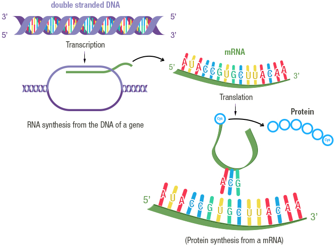
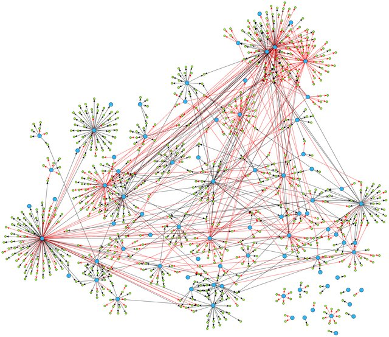

This advanced workshop is an introduction to the stochastic simulation of Gene Regulatory Networks (GRNs) using the R package `sismonr`. You will learn the basics of simulating GRNs, and how to scale up simulations on a HPC.

## Pre-workshop information

## Prerequisites

- Familiarity with bash and R
- Basic molecular biology knowledge preferred (gene expression and regulation)
- HPC knowledge preferred

## Learning goals

## Schedule

## Outline (draft)

1. Introduction:
    1. Why are simulations important in research?
    2. What are Gene Regulatory Networks?
    3. Simulating Gene Regulatory Networks
    4. The sismonr package
    5. A (brief) introduction to the Stochastic Simulation algorithm
2. The research question
    1. The topic (simulation of anthocyanin biosynthesis pathway)
    2. Setting on local machine
    3. The main steps of a scaling project
3. First steps on the HPC
    1. Loading modules (R and Julia)
    4. Running a test script
4. Scaling up your work
    1. Assessing time and memory usage
    2. profiling code
5. Parallel computing on NeSI
    1. Introduction to parallel computing
    2. How to execute parallel code on NeSI
6. Post-processing
    1. Analysing the output

## Introduction

### Why are simulations important in research?

### What are Gene Regulatory Networks?

#### An overview of gene expression

The instructions necessary to a cell's functioning are encoded in its DNA, which is composed of two anti-parallel chains of nucleotides, intertwined into a double helix. Some portions of this DNA molecule, termed protein-coding genes, contain instructions about the synthesis of proteins, which are important molecular actors fulfilling essential roles in the cell. The complex multi-step process of decoding this information and using it to produce proteins is what we call gene expression. Briefly, gene expression involves:

1. Transcription: the sequence of nucleotides that forms the gene is copied into a "free-floating" version called messenger RNA (mRNA), as the result of a complex series of biochemical interactions involving enzymes and other molecules.
2. Translation: the messenger RNA is used as a template to create proteins; each consecutive triplet of nucleotides is translated into a specific amino acid (the building blocks of proteins). The correspondence between triplets of nucleotides and amino acids is known as the genetic code. A sequence of amino acids is thus created from the messenger RNA template, and, once completed, constitutes the synthesised protein.
3. Post-translational modifications: once synthesised, a protein may have to undergo some transformations before attaining its functional state. Such modifications include changes in conformation (i.e. the way in which the sequence of amino acids is folded in the 3D space), cleavage of a portion of the amino acid sequence, addition of molecular signals to specific amino acids, or binding to other proteins to form protein complexes.

#### Regulation of gene expression

Cells respond and adapt to changes in the environment or other inter- and intra-cellular cues by modulating the expression of their genes, which affects the pool of available proteins. Regulation of gene expression can be achieved by different types of molecular actors: proteins encoded by other genes, regulatory non-coding RNAs (i.e. molecules of RNAs that are not used to produce proteins), or even metabolites.

Regulators can control the expression of a given target gene by affecting different steps of the target's expression:

- Regulation of transcription: this is the most-studied type of gene expression regulation. The regulatory molecule (a protein that regulates transcription are called a transcription factor) controls the production of messenger RNAs from the target gene.
- Regulation of translation: the regulatory molecule controls the rate at which target mRNAs are translated to synthesise proteins.
- Decay regulation: the regulatory molecule affects the rate at which the target mRNAs or proteins are degraded.
- Post-translational regulation: the regulator modifies the shape or sequence of its target proteins, thus affecting the ability of the target protein to perform its cellular function.

Regulators that increase the expression of their target are called activators; those decreasing the expression of their target are called repressors. Typically, the relationship between regulator and target is quite specific, with most regulators controlling the expression of only a few target genes, and most genes being controlled by a small set of regulators. 

As scientists gain knowledge into the regulatory relationships between genes, they summarisethis information into graphs, which we call Gene Regulatory Networks (GRN). In these graphs, nodes represent genes, and a directed arrow from Gene A directed to Gene B informs that the products of Gene A control the expression of gene B. An example of GRN is given in Figure X.

A given environmental cue typically triggers the activation of a specific regulatory pathway (i.e. a part of the cell-wide GRN), with regulators modulating the expression of their target in a cascade. Thus, understanding the dynamics of gene expression regulation is key to deciphering how organisms react to certain triggers.
